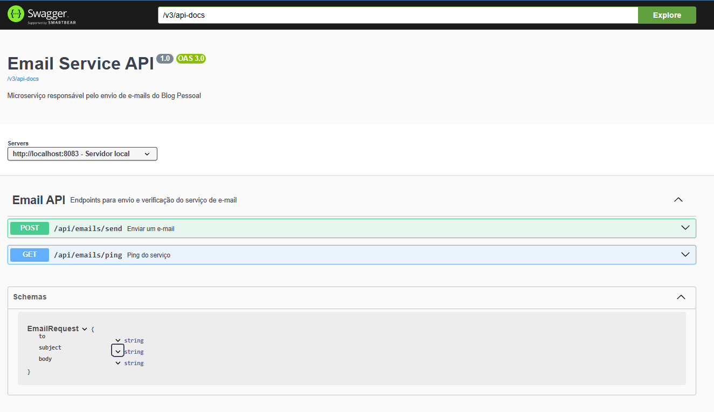

# 1. Informações da Aplicação
- Porta 8083
- Banco de dados MySQL
- Dois containers, um para aplicação(8083) e outro para o banco(3307)

# 2. Eureca
- Foi comentada no docker-compose.yml pra testar a aplicação contenerizada, basta descomentar e fazer os devidos ajustes nessa parte

# 3. Ajustes no Docker Desktop
1. Abra Docker Desktop → Settings → Docker Engine.
2. Altere o JSON adicionando "dns": ["8.8.8.8", "8.8.4.4"], por exemplo:
```
{ 
    "builder":
        { "gc": { 
            "defaultKeepStorage": "20GB", 
            "enabled": true 
        } 
    },
     "experimental": false, 
     "dns": ["8.8.8.8", "8.8.4.4"] 
}
```

# 4. Swagger
- Endereço:  http://localhost:8083/swagger-ui/index.html#/
- EndPoints:
    - POST - Enviar EmaIl
    - GET -  Teste de conexão
  
